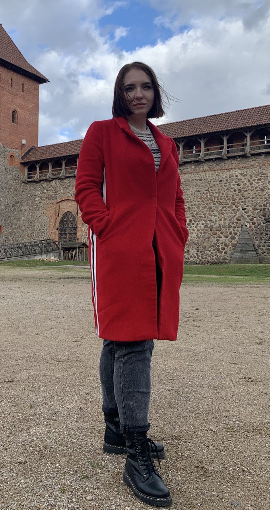

# Polina Kurlovich



## Contacts
- ***email:*** *polinamironchik@gmail.com*
- ***telephone:*** *+375298941211*
- ***discord:*** *Polina (@polinakurlovich)*

## Information about me
*I'm a goal-oriented person who loves to learn something new from different areas of life. 
I consider myself hardworking, responsible and diligent, I always bring what I started to the end.
At the moment, I work as an engineer at a drug manufacturing plant, but I really want to change my 
field of activity to IT. In my free time I study foreign languages.*

## Education
*BSTU 2016-2021. Chemical technologist.*

## English level
*I'm gradually learning English. My current level is B1*

## Skills
- *Git*
- *Java Script*
- *HTML*
- *CSS*

## Code examples
```
<html>
<body>
  <script>
    alert( 'Привет, мир!' );
  </script>
</body>
</html>
```

## Projects
- *CV*
